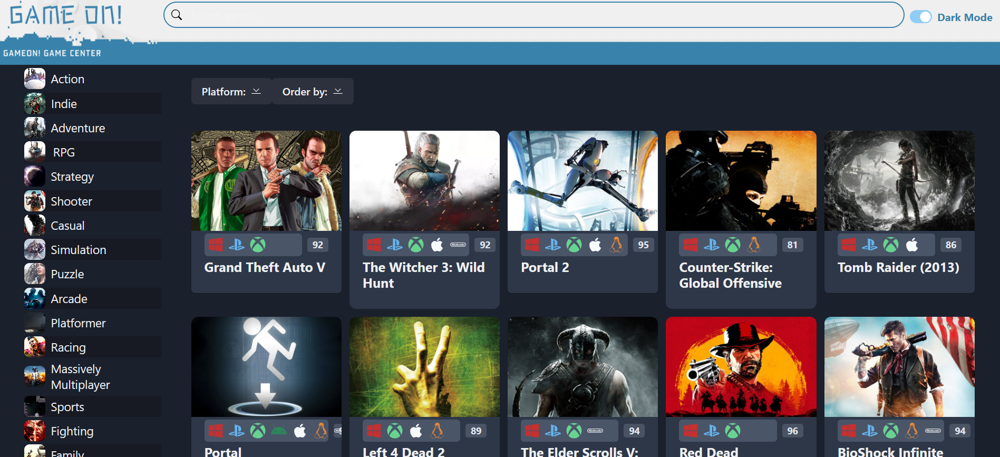
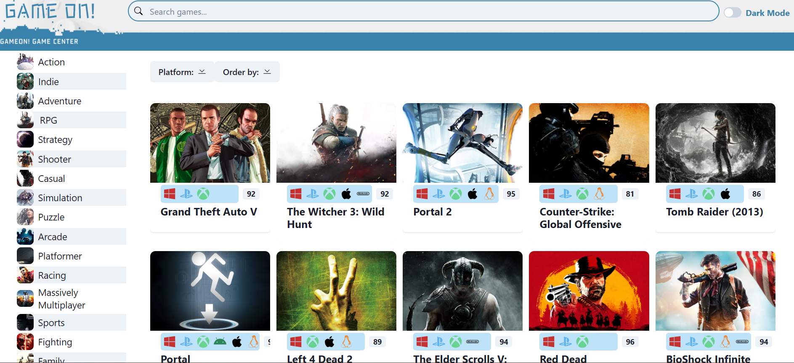

# GameON

GameON is a video game discovery web app that helps you find new and interesting games to play. With GameON, you can search for games by platform, genre, and more.

This project followed [Mosh Hamedani's Game Hub tutorial](https://github.com/mosh-hamedani/game-hub) and has been enhanced with my own ideas and a Node.js proxy server. It is now deployed as an Azure Static Web App.

## Features

- Search for games by platform, genre, and more
- Discover new and trending games
- Detailed game information and screenshots
- User-friendly interface with dark and light modes

## Screenshots

### Dark Mode

### Light Mode

